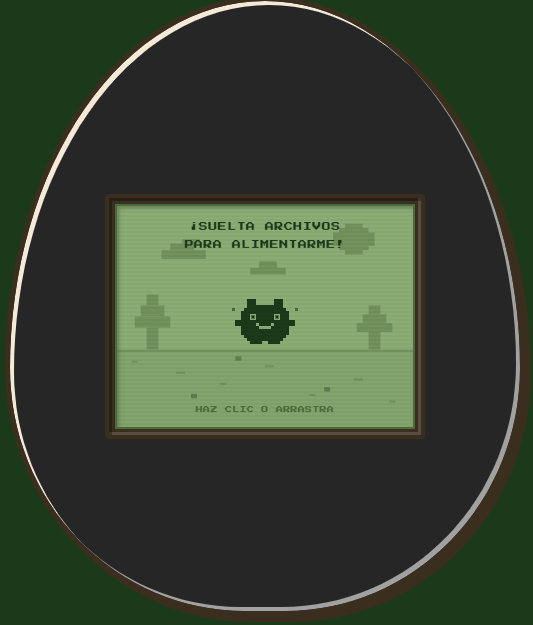
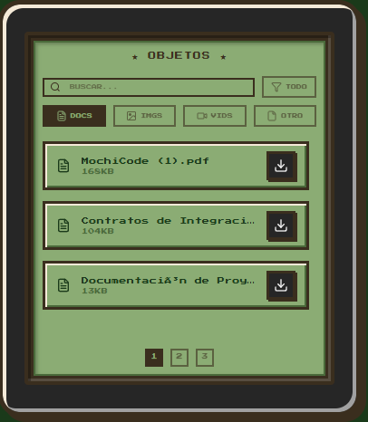
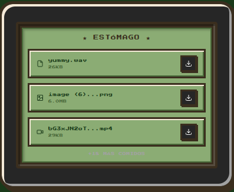

# Taller Bucket - Proyecto S3 con LocalStack, Terraform, NestJS y Next.js

Este proyecto es una aplicación full-stack que utiliza **LocalStack** para emular un bucket de AWS S3 de manera local. La infraestructura está automatizada con **Terraform**, el backend está desarrollado en **NestJS** y el frontend en **Next.js**.

## 🚀 Requisitos Previos

Asegúrate de tener instalados los siguientes componentes antes de comenzar:
- [Docker](https://www.docker.com/products/docker-desktop) y Docker Compose
- [Terraform](https://developer.hashicorp.com/terraform/downloads)
- [Node.js](https://nodejs.org/es/)
- [pnpm](https://pnpm.io/es/) o `npm`

---

## 🛠️ Pasos para levantar el proyecto

Sigue el orden de los siguientes pasos para ejecutar el proyecto correctamente en tu máquina local.

### 1. Iniciar LocalStack (Emulador de AWS)
Primero, levantaremos LocalStack, que proveerá el servicio de S3 localmente en el puerto `4566`.

Abre una terminal en la raíz del proyecto y ejecuta:
```bash
docker-compose up -d
```
*Verifica que el contenedor `TallerBucket-localstack` esté en ejecución.*

---

### 2. Provisionar la infraestructura (Terraform)
Una vez que LocalStack esté en ejecución, usaremos Terraform para crear nuestro bucket S3 (`tallerbucket-drive`).

Abre otra terminal, navega a la carpeta `terraform/` y ejecuta los siguientes comandos:
```bash
cd terraform
terraform init
terraform plan
terraform apply -auto-approve
```
*Esto creará el bucket S3 local con los permisos de acceso público configurados.*

---

### 3. Levantar el Backend (NestJS)
El backend se encarga de comunicarse con el S3 local. 

Navega a la carpeta `Backend/`, instala las dependencias y corre el servidor en modo desarrollo:
```bash
cd Backend
npm install
npm run start:dev
```
*Nota: El backend utilizará las credenciales y configuraciones definidas en `Backend/.env`, conectándose al puerto `3000` por defecto.*

---

### 4. Levantar el Frontend (Next.js)
El frontend proporciona la interfaz de usuario para interactuar con la aplicación.

Abre una nueva terminal, navega a la carpeta `Frontend/`, instala las dependencias y corre la aplicación web:
```bash
cd Frontend
npm install    # o 'pnpm install'
npm run dev    # o 'pnpm dev'
```
*Nota: Revisa en la consola en qué puerto se inicia Next.js (usualmente `http://localhost:3000` o `3001` si el backend ya está ocupando el `3000`).*

---

## 🛑 Cómo detener el entorno

Para detener el servidor de AWS S3 local y eliminar los contenedores generados:
```bash
docker-compose down
```
*(Si deseas destruir los recursos de terraform de manera explícita, puedes hacer `terraform destroy` en la carpeta `terraform/` antes de bajar los contenedores).*

---

## 🎮 Cómo usarlo

Una vez que el Frontend esté corriendo, abre tu navegador en la URL indicada (usualmente `http://localhost:3001` o `3000`). El flujo de uso es el siguiente:

1. **Pantalla Principal (Tamagotchi)**
   En el centro de la pantalla encontrarás al Tamagotchi.
   - **Subida de Archivos:** Arrastra y suelta uno o más archivos (documentos, imágenes, videos) directamente sobre el personaje, o haz clic en él para abrir el selector de archivos. Al hacerlo, el Tamagotchi será "alimentado" y el archivo se subirá al sistema.
   - 

2. **Objetos (Lista Completa de Archivos)**
   A la izquierda encontrarás la sección de Objetos.
   - **Navegación:** Aquí verás todos los archivos que has subido. Usa los botones numéricos inferiores (`<`, `1`, `2`, `>`) para navegar entre las páginas.
   - **Filtros y Búsqueda:** Utiliza la barra superior de esta tarjeta para buscar archivos por nombre o filtrarlos rápidamente por tipo (Imágenes, Videos, Docs, etc).
   - 

3. **Estómago (Archivos Recientes y Descarga)**
   A la derecha verás el Estómago.
   - **Visualización Rápida:** Aquí se muestran exclusivamente los últimos 3 archivos que han sido procesados por el sistema, indicando el historial más reciente.
   - **Descarga:** Haz clic en el botón con el ícono de descarga al lado de cualquier archivo (tanto en el Estómago como en Objetos) para descargarlo de vuelta a tu computadora a través de LocalStack.
   - 

---

## ⚙️ Cómo funciona el proyecto

Este proyecto simula un entorno Cloud descentralizado (como Google Drive) de manera 100% local, empleando una arquitectura por capas:

1. **Infraestructura (Terraform + LocalStack):** En lugar de depender de AWS real, usamos **LocalStack** a través de Docker para emular un entorno S3 de Amazon. **Terraform** actúa como Infraestructura como Código (IaC), ejecutándose para aprovisionar automáticamente el Bucket necesario dentro de LocalStack. Todo lo que subas persiste de manera segura en el volumen `localstack_data` de tu disco.
2. **Backend (NestJS):** Actúa como el puente (API) entre el cliente y el almacenamiento. 
   - Recibe los archivos (`POST /files/upload`) empaquetados en `FormData` y usa el SDK oficial de AWS (`@aws-sdk/client-s3`) para guardarlos en el bucket local. 
   - Expone endpoints como `GET /files/all` que hace uso del comando `ListObjectsV2Command` para traer todos los objetos, y `GET /files/download/:key` que retorna un Stream directo de descarga para el cliente.
3. **Frontend (Next.js / React):** Ofrece la experiencia interactiva estilo "retro". Gestiona estados locales para la paginación y filtros de los objetos. Se comunica en tiempo real con el backend mediante `fetch` para subir archivos y solicitar los listados actualizados inmediatamente después de que ocurre una acción en la UI.

## 🗂️ Estructura del Proyecto

- `/Frontend`: Aplicación web en Next.js, React y Tailwind.
- `/Backend`: API REST en NestJS configurada para el AWS SDK S3 apuntando al LocalStack.
- `/terraform`: Archivos IaC (Infrastructure as Code) para la creación del Bucket.
- `docker-compose.yml`: Archivo para el despliegue del LocalStack.
